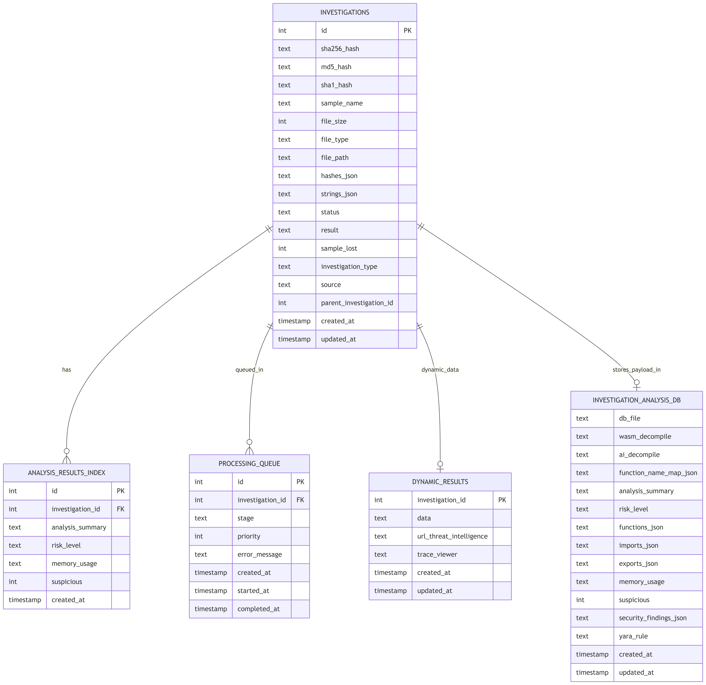

# WISE
WebAssembly Intelligent Security Engine.


WISE is a security-focused WebAssembly analysis platform for malware analysis and reverse engineering.  
It combines static decompilation, URL-based dynamic analysis, threat-intel enrichment, and investigation tracking in one workflow.

## Table of Contents
- [What WISE Does](#what-wise-does)
- [Quick Start](#quick-start)
- [Configuration](#configuration)
- [Runbook](#runbook)
- [Architecture](#architecture)
- [Data Model](#data-model)
- [LangGraph Decompiler Chain](#langgraph-decompiler-chain)
- [App Flow](#app-flow)
- [Troubleshooting](#troubleshooting)

## What WISE Does
- Analyzes `.wasm` samples with `wasm-decompile` and AI-assisted reconstruction.
- Performs URL dynamic analysis with Docker + Playwright instrumentation.
- Generates analyst artifacts (decompiled code, summaries, function name maps, findings, traces).
- Enriches investigations with CTI sources (VirusTotal, AlienVault OTX, OpenCTI).
- Stores each investigation with queue status and result metadata for triage and review.

## Quick Start
### Prerequisites
- Python `3.12+`
- Node.js `18+`
- Docker
- `wabt` toolkit (`wasm2wat`)
- (Optional) `binaryen` (`wasm-decompile`)

Ubuntu/Debian packages:
```bash
sudo apt update
sudo apt install -y \
  python3 python3-venv python3-pip \
  nodejs npm \
  docker.io \
  wabt binaryen \
  binutils ssdeep \
  git curl
```

Notes:
- `binutils` provides `strings` used for artifact enrichment.
- `ssdeep` enables fuzzy hash generation for metadata.
- Add your user to Docker group and re-login:
```bash
sudo usermod -aG docker "$USER"
```

### Setup
```bash
git clone <your-repo-url>
cd WISE
./setup.sh
```

`setup.sh` creates a virtualenv, installs Python dependencies, initializes DB, builds Docker images (if Docker exists), and builds frontend assets (if `npm` exists).

### Run Services
Backend:
```bash
source virtualenv/bin/activate
uvicorn backend.main:app --reload --host 0.0.0.0 --port 8000
```

Frontend:
```bash
cd frontend
npm install
npm run dev
```

Endpoints:
- API: `http://localhost:8000`
- API docs: `http://localhost:8000/docs`
- UI: `http://localhost:5173`

## Configuration
WISE uses centralized configuration in `wise_config.py` with env var overrides.

Core runtime keys:
```bash
export OPENAI_API_KEY="sk-..."
export ANTHROPIC_API_KEY="sk-..."
export GOOGLE_API_KEY="..."
export OPENROUTER_API_KEY="sk-..."
```

Optional CTI keys:
```bash
export VIRUSTOTAL_API_KEY="..."
export OPENCTI_API_KEY="..."
export OTX_API_KEY="..."
```

Optional frontend `.env` (`frontend/.env`):
```bash
VITE_API_BASE=http://localhost:8000/api
VITE_API_TIMEOUT=30000
```

## Runbook
1. Start backend and frontend.
2. Submit a WASM file or URL from the UI.
3. Worker processes queue and updates investigation status.
4. Review outputs:
- static analysis (`decompiled C`, `summary`, `function map`, `security findings`, `YARA`)
- dynamic artifacts (`trace`, `network`, runtime artifacts)
5. Re-run investigation from the UI if needed.

## Architecture
High-level application flow from user interaction to analysis pipelines and enrichment services.


Key points:
- Frontend calls FastAPI for ingestion, queue visibility, and result retrieval.
- Backend orchestrates work and persists orchestration state in `backend/wise.db`.
- Background worker executes static and dynamic pipelines.
- Threat-intel integration enriches analysis output.

## Infrastructure
Deployment view of host-local components, containerized runtime, and external dependencies.


Key points:
- `AppHost` contains API, worker, frontend, and storage.
- `DynInfra` isolates runtime website execution through Docker + Playwright.
- External providers are optional but used for LLM inference and CTI enrichment.

## Data Model
Logical schema for `backend/wise.db` and per-investigation payload DBs.



Key points:
- `investigations` is the root table.
- `analysis_results` is the lightweight index table in `wise.db`.
- Heavy static-analysis payloads are stored in `backend/analysis_results/analysis_<id>.db`.
- `processing_queue` tracks worker lifecycle.
- `dynamic_results` stores dynamic run data, cached CTI, and trace-viewer payload.
- Foreign keys in `wise.db` are enforced with `ON DELETE CASCADE`.

## LangGraph Decompiler Chain
Execution stages for AI-assisted static decompilation from WASM input to analyst-ready output.


Stages:
1. Parsing: load and structure WASM program content.
2. Code reconstruction: symbol inference, lifting, refinement, and finalization.
3. Security analysis: vulnerability scanning on finalized output.
4. Reporting: analyst-readable summary generation.
5. Artifacts: decompiled C, summary, function map, and security findings.

## App Flow
End-to-end user workflow in the WISE interface.


## Troubleshooting
- Backend fails to start: activate virtualenv and ensure `pip install -r requirements.txt` was run.
- Dynamic analysis fails: check Docker daemon status and image build logs.
- Missing CTI results: ensure API keys are set and outbound access is available.
- Empty static outputs: verify sample is valid WASM and required binaries are installed (`wabt`, optional `binaryen`).
